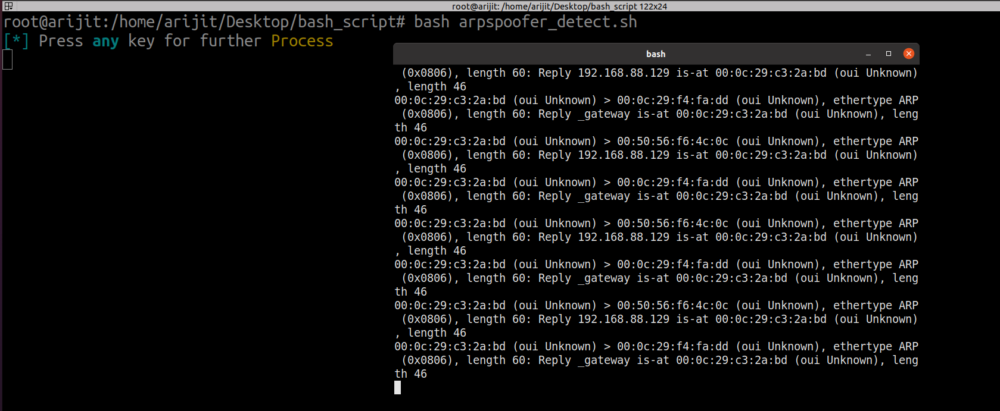

<h1 align="center">
  </a>
  <br>

</h1>

<h1 align="center">
   MITM Detection & Preventions </a>
  <br>

</h1>

>**I build this Project in Cybermaniya of Jetking 2022 that Detect MITM Attack and also give you the Soluions.**


````
When you run 'arpspoofing_detect.sh' it will open another terminal and it will show only ARP_Replay packet. Inspecting the packet you can easily identify the packet are crafted or Not. 

If 'arpspoofing_detect.sh' capture worng mac address you can manually mentions the mac address of who sending the arp_reply packet 
and it will fetch you corresponding Ip Address of that.

````
<b> Note ! </b> 
````
You can manually change <interface name> in arp_spoofing.sh file.
````


## Usage
```
┌──(root㉿kali)-[~/Desktop/bash_script]
└─# bash arpspoofing.sh <target-ip>

OR

┌──(root㉿kali)-[~/Desktop/bash_script]
└─# bash arpspoofing_detect.sh <interface name>
```

<h1 align="left">
  </a>
  <br>
</h1>

<h1 align="left">
  </a>
  <br>
</h1>

<h1 align="left">
  </a>
  <br>
</h1>


##### Prerequisites
- tcpdump {apt-get install tcpdump}
- nmap {apt-get install nmap}
- nping {apt-get install nmap} OR {apt install nmap -y } [nping is part of of the nmap package]
- ngrep {apt-get install ngrep} OR {apt install ngrep -y}

